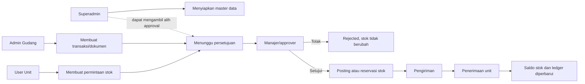
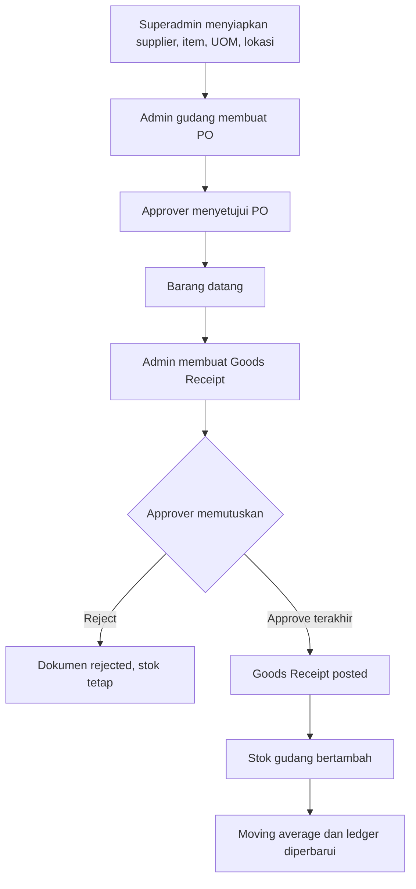
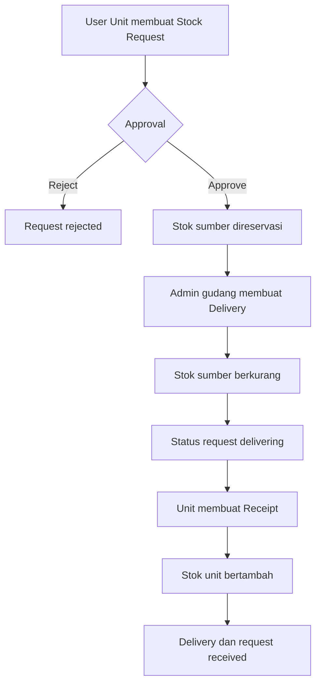
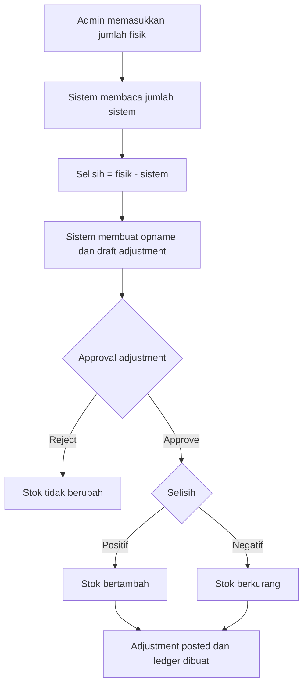

# Alur Sistem WMS Berdasarkan Role

Dokumen ini memetakan alur aktual berdasarkan route, controller, service, dan role yang tersedia pada aplikasi. Role yang digunakan adalah:

1. `superadmin` — Superadmin
2. `warehouse_admin_dry` — Admin Gudang Kering
3. `warehouse_admin_wet` — Admin Gudang Basah
4. `unit_user` — User Unit
5. `unit_manager` — Manajer Unit/Gudang

## 1. Gambaran Umum Alur

Prinsip utamanya:

- Pembuat transaksi tidak langsung mengubah stok.
- Transaksi masuk antrean approval dengan status `waiting_approval` atau workflow `pending`.
- Penolakan menghentikan proses dan tidak mengubah stok.
- Persetujuan terakhir mem-posting stok, membuat reservasi, atau mengizinkan proses berikutnya.
- Semua role harus login dan memiliki email terverifikasi.

## 2. Matriks Hak Akses Aktual

| Fitur | Superadmin | Admin Gudang Kering | Admin Gudang Basah | User Unit | Manajer Unit/Gudang |
|---|---|---|---|---|---|
| Dashboard | Semua data sistem | Semua data sistem* | Semua data sistem* | Semua data sistem* | Semua data sistem* |
| Lihat stok gudang | Semua gudang + filter | Gudang yang ditetapkan | Gudang yang ditetapkan | Unit yang ditetapkan | Gudang/unit yang ditetapkan |
| Master data | Kelola | Tidak | Tidak | Tidak | Tidak |
| Purchasing | Buat dan lihat | Buat dan lihat | Buat dan lihat | Tidak | Tidak |
| Fulfillment | Dapat mengakses | Dapat mengakses | Dapat mengakses | Dapat mengakses | Dapat mengakses |
| Inventory control | Buat dan lihat | Buat dan lihat | Buat dan lihat | Tidak | Tidak |
| Transaksi stok sederhana | Tidak | Gudang sendiri | Gudang sendiri | Tidak | Tidak |
| Approval transaksi sederhana | Semua transaksi | Tidak | Tidak | Tidak | Transaksi yang ditugaskan |
| Approval workflow operasional | Semua tahap | Jika ditunjuk sebagai approver | Jika ditunjuk sebagai approver | Jika ditunjuk sebagai approver | Jika ditunjuk sebagai approver |
| Unduh PDF transaksi | Ya* | Ya* | Ya* | Ya* | Ya* |

`*` Menunjukkan perilaku backend saat ini yang belum dibatasi per role/gudang secara penuh; lihat bagian “Catatan Implementasi”.

## 3. Alur Superadmin

### 3.1 Persiapan master data

1. Login dan masuk ke modul **Master Data**.
2. Menambah atau mengubah supplier:
   - kode supplier;
   - nama;
   - telepon;
   - alamat;
   - status aktif.
3. Menambah atau mengubah satuan/UOM:
   - kode;
   - nama;
   - tipe `base` atau `small`;
   - status aktif.
4. Menambah atau mengubah lokasi gudang:
   - pilih gudang;
   - kode dan nama lokasi;
   - tipe `zone`, `rack`, atau `bin`;
   - status aktif.
5. Menambah atau mengubah item:
   - kode dan nama item;
   - satuan dasar;
   - tipe gudang `dry`, `wet`, atau `both`;
   - minimum stok dan reorder point;
   - metode pengeluaran `manual`, `FIFO`, atau `FEFO`;
   - pengelolaan batch dan kedaluwarsa;
   - status aktif.
6. Data aktif tersedia sebagai referensi transaksi operasional.

### 3.2 Monitoring stok

1. Buka **Warehouse Stocks**.
2. Sistem menampilkan stok seluruh gudang.
3. Superadmin dapat memfilter gudang tertentu.
4. Untuk setiap stok, sistem menampilkan item, gudang, lokasi, batch, tanggal kedaluwarsa, `qty_on_hand`, `qty_reserved`, stok tersedia, dan biaya rata-rata.
5. Gunakan ringkasan untuk memantau stok tersedia, reservasi, nilai stok, dan stok rendah.

### 3.3 Approval transaksi sederhana

1. Buka **Approvals**.
2. Sistem menampilkan seluruh `stock_transactions` berstatus `waiting_approval`.
3. Periksa pembuat, gudang asal/tujuan, item, jumlah, batch, biaya, dan catatan.
4. Pilih salah satu keputusan:
   - **Approve**: sistem mem-posting stok dan mengubah status menjadi `completed`.
   - **Reject**: wajib memberi catatan minimal 5 karakter; status menjadi `rejected` dan stok tidak berubah.
5. Dampak approval:
   - stock in: stok tujuan bertambah dan moving average cost dihitung ulang;
   - stock out: stok sumber berkurang;
   - transfer: stok sumber berkurang dan stok tujuan bertambah dengan biaya dari sumber;
   - setiap perubahan dicatat ke stock ledger.

### 3.4 Approval workflow operasional

1. Masuk ke modul operasional yang memuat antrean approval.
2. Sistem menampilkan seluruh workflow berstatus `pending` kepada superadmin.
3. Superadmin dapat bertindak walaupun bukan approver yang ditetapkan.
4. Jika ditolak:
   - tahap aktif menjadi `rejected`;
   - workflow dan dokumen menjadi `rejected`;
   - stok tidak berubah.
5. Jika disetujui dan masih ada level berikutnya:
   - tahap aktif menjadi `approved`;
   - `current_level` berpindah ke approver berikutnya.
6. Jika ini persetujuan terakhir:
   - workflow menjadi `approved`;
   - purchase order hanya berubah menjadi `approved`;
   - goods receipt langsung diposting dan stok bertambah;
   - stock request mereservasi stok sumber;
   - stock adjustment langsung diposting ke stok dan ledger.

## 4. Alur Admin Gudang Kering

Admin Gudang Kering hanya dapat menggunakan transaksi stok sederhana untuk gudang yang terhubung ke akunnya. Daftar item dibatasi pada item bertipe `dry` dan `both`.

### 4.1 Penerimaan supplier / stock in

1. Login dengan akun yang memiliki `warehouse_id` gudang kering.
2. Buka halaman **Stok Masuk**.
3. Pilih mode penerimaan supplier.
4. Isi tanggal dokumen, supplier, item, jumlah, biaya satuan, batch, tanggal kedaluwarsa bila ada, dan catatan.
5. Sistem memaksa gudang tujuan menjadi gudang milik admin.
6. Sistem mencari `unit_manager` yang terhubung ke gudang yang sama.
7. Jika manajer belum dikonfigurasi, pengajuan gagal.
8. Jika valid, transaksi dibuat dengan status `waiting_approval` dan ditugaskan ke manajer tersebut.
9. Sebelum disetujui, stok belum bertambah.
10. Setelah manajer menyetujui, stok bertambah, biaya rata-rata dihitung ulang, ledger dibuat, dan status menjadi `completed`.
11. Jika ditolak, status menjadi `rejected` dan stok tidak berubah.

### 4.2 Stock out

1. Buka halaman **Stok Keluar**.
2. Pilih jenis `stock_out`.
3. Isi item, jumlah, batch, tanggal dokumen, dan catatan.
4. Sistem mengabaikan gudang asal dari input dan memaksa gudang asal menjadi gudang admin.
5. Transaksi masuk ke manajer gudang yang sama dengan status `waiting_approval`.
6. Saat disetujui, sistem memeriksa saldo item dan batch.
7. Jika saldo cukup, stok berkurang, ledger keluar dibuat, dan transaksi `completed`.
8. Jika saldo tidak cukup, posting gagal dan stok tidak boleh menjadi negatif.

### 4.3 Transfer antar gudang

1. Buka halaman **Stok Keluar** dan pilih `transfer`.
2. Gudang asal otomatis menggunakan gudang admin.
3. Pilih gudang tujuan yang berbeda.
4. Isi item, jumlah, batch, dan catatan.
5. Ajukan ke manajer gudang asal.
6. Setelah disetujui:
   - stok gudang asal berkurang;
   - stok gudang tujuan bertambah;
   - biaya pada gudang tujuan mengikuti biaya stok sumber;
   - ledger keluar dan masuk dibuat;
   - status transaksi menjadi `completed`.

### 4.4 Purchasing dan inventory control

Admin juga dapat membuat dokumen pada workflow operasional:

- purchase order;
- goods receipt;
- stock adjustment;
- stock opname;
- stock request;
- delivery dan receipt.

Setiap dokumen yang memerlukan approval harus memilih approver. Goods receipt dan adjustment baru memengaruhi stok setelah approval terakhir. Stock opname menghasilkan adjustment sebesar `count_qty - system_qty` dan adjustment tersebut diajukan untuk approval.

## 5. Alur Admin Gudang Basah

Alurnya sama dengan Admin Gudang Kering, tetapi pilihan item pada transaksi stok sederhana dibatasi pada `wet` dan `both`.

Perhatian operasional khusus:

1. Batch dan tanggal kedaluwarsa sebaiknya selalu diisi untuk bahan basah.
2. Item basah pada seed aplikasi menggunakan metode FEFO.
3. Pada workflow operasional, pengeluaran memilih stok dengan tanggal kedaluwarsa terdekat terlebih dahulu, lalu tanggal pencatatan paling awal.
4. Saat penerimaan disetujui, stok disimpan per gudang, item, dan batch beserta tanggal kedaluwarsa.
5. Saat stock out, transfer, delivery, adjustment negatif, atau waste, pastikan jumlah stok batch mencukupi.

Urutan lengkapnya tetap: **buat dokumen → validasi gudang dan item → tentukan approver → waiting approval → approve/reject → posting stok dan ledger**.

## 6. Alur User Unit

### 6.1 Melihat stok unit

1. Login dengan akun yang memiliki `warehouse_id` unit.
2. Buka **Warehouse Stocks**.
3. Sistem hanya mengambil stok pada unit yang terhubung ke akun.
4. User tidak dapat mengganti filter ke gudang atau unit lain.

### 6.2 Mengajukan permintaan stok melalui fulfillment

1. Buka modul **Fulfillment**.
2. Buat stock request dengan mengisi:
   - gudang sumber;
   - gudang/unit tujuan;
   - tipe `to_unit`, `transfer`, atau `withdrawal`;
   - item, UOM, jumlah, catatan;
   - approver.
3. Sistem membuat nomor `REQ`, detail permintaan, dan workflow approval.
4. Status permintaan menjadi `waiting_approval`.
5. Jika ditolak, proses berhenti dan stok tidak direservasi.
6. Jika disetujui:
   - sistem mencari stok tersedia dari gudang sumber;
   - urutan alokasi mengutamakan kedaluwarsa terdekat lalu stok tertua;
   - `qty_reserved` bertambah;
   - detail permintaan memperoleh `qty_approved`;
   - status permintaan menjadi `approved`.
7. Admin gudang membuat delivery.
8. Saat delivery dikirim, stok sumber berkurang dan reservasi menjadi `consumed`; status permintaan menjadi `delivering`.
9. Penerima membuat receipt.
10. Saat receipt diproses, stok tujuan bertambah; delivery dan request menjadi `received`.

### 6.3 Batasan

- User Unit tidak dapat membuka atau membuat transaksi melalui fitur stok masuk/keluar sederhana.
- User Unit tidak dapat mengelola master data, purchasing, atau inventory control.
- Secara konsep, tujuan permintaan dan penerimaan harus unit milik user; backend saat ini belum memaksa keterkaitan tersebut pada endpoint fulfillment.

## 7. Alur Manajer Unit/Gudang

### 7.1 Approval transaksi sederhana

1. Login dan buka **Approvals**.
2. Sistem hanya menampilkan transaksi `waiting_approval` dengan `assigned_approver_id` milik manajer.
3. Manajer tidak dapat menyetujui transaksi milik approver lain.
4. Periksa jenis transaksi, pembuat, gudang asal/tujuan, item, jumlah, batch, biaya, dan catatan.
5. Jika menolak:
   - isi alasan minimal 5 karakter;
   - transaksi menjadi `rejected`;
   - stok tidak berubah.
6. Jika menyetujui:
   - sistem mengunci transaksi untuk mencegah posting ganda;
   - memvalidasi status masih `waiting_approval`;
   - memvalidasi kecukupan stok untuk pengeluaran/transfer;
   - memperbarui current stock dan stock ledger;
   - menyimpan `approved_by`, `approved_at`, dan `posted_at`;
   - transaksi menjadi `completed`.

### 7.2 Approval workflow operasional

1. Masuk ke modul **Fulfillment**.
2. Sistem hanya menampilkan workflow apabila manajer adalah approver pada level aktif.
3. Pilih `approved` atau `rejected`, serta isi catatan bila diperlukan.
4. Jika approval bertingkat, persetujuan hanya memindahkan proses ke level berikutnya.
5. Posting/reservasi baru dilakukan setelah level terakhir menyetujui.

### 7.3 Monitoring stok

1. Buka **Warehouse Stocks**.
2. Sistem hanya menampilkan stok gudang atau unit yang terhubung ke akun.
3. Gunakan jumlah tersedia (`qty_on_hand - qty_reserved`) untuk menilai apakah permintaan dapat dipenuhi.

## 8. Alur End-to-End Utama

### 8.1 Pengadaan hingga stok masuk

### 8.2 Permintaan unit hingga penerimaan

### 8.3 Stock opname

## 9. Status Dokumen

| Status | Arti | Dampak stok |
|---|---|---|
| `draft` | Dokumen belum diajukan atau dokumen turunan masih disiapkan | Tidak berubah |
| `waiting_approval` | Menunggu keputusan approver | Tidak berubah |
| `pending` | Workflow approval masih aktif | Tidak berubah |
| `approved` | Disetujui; untuk request berarti stok sudah direservasi | Tergantung jenis dokumen |
| `posted` | Goods receipt/adjustment selesai diposting | Sudah berubah |
| `completed` | Transaksi stok sederhana selesai diposting | Sudah berubah |
| `delivering` | Barang keluar dari sumber dan sedang dikirim | Sumber berkurang |
| `shipped` | Delivery telah dikirim | Sumber berkurang |
| `received` | Barang telah diterima tujuan | Tujuan bertambah |
| `rejected` | Ditolak approver | Tidak berubah |

## 10. Catatan Implementasi yang Perlu Ditindaklanjuti

Dokumentasi di atas mengikuti kode saat ini. Beberapa kontrol akses belum konsisten dan sebaiknya diperbaiki sebelum produksi:

1. Dashboard menghitung dan menampilkan data global untuk semua role, belum dibatasi berdasarkan gudang user.
2. Halaman Fulfillment dapat dibuka oleh seluruh role dan endpoint pembuatan stock request/receipt belum memvalidasi role maupun kepemilikan gudang/unit.
3. Daftar record pada modul operasional belum difilter berdasarkan gudang user.
4. Superadmin dapat membuat purchasing/inventory workflow, tetapi sengaja tidak dapat memakai fitur transaksi stok sederhana.
5. Endpoint unduh PDF transaksi hanya memerlukan login; belum memeriksa apakah transaksi terkait dengan user atau gudangnya.
6. Approver workflow dapat dipilih dari seluruh Unit Manager dan Superadmin; belum divalidasi harus terkait dengan gudang dokumen.
7. Admin gudang pada workflow operasional dapat memilih gudang mana pun; pembatasan gudang sendiri baru diterapkan tegas pada transaksi stok sederhana.
8. Menu sidebar saat ini hanya menampilkan Dashboard. Fitur lain tersedia melalui route, tetapi navigasi berbasis role belum dibangun.
9. Terdapat dua mekanisme paralel untuk proses stok: `stock_transactions`/`StockService` dan workflow operasional/`InventoryWorkflowService`. Batas penggunaan keduanya perlu diputuskan agar tidak membingungkan pengguna dan audit.

